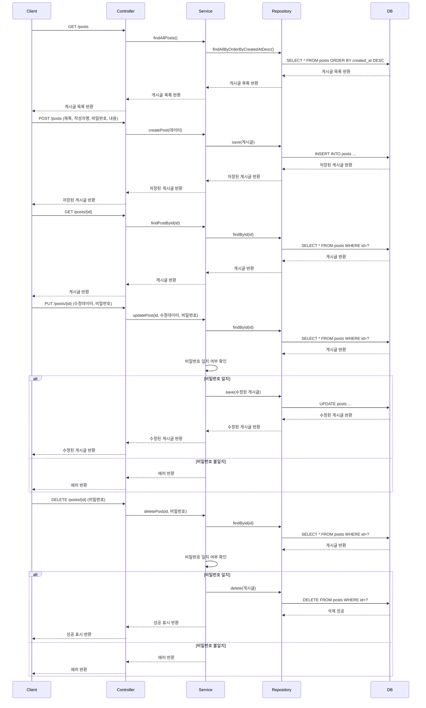

# 시퀀스 다이어그램

```mermaid
sequenceDiagram
    participant Client
    participant Controller
    participant Service
    participant Repository
    participant DB

    %% 전체 게시글 목록 조회
    Client->>Controller: GET /posts
    Controller->>Service: findAllPosts()
    Service->>Repository: findAllByOrderByCreatedAtDesc()
    Repository->>DB: SELECT * FROM posts ORDER BY created_at DESC
    DB-->>Repository: 게시글 목록 반환
    Repository-->>Service: 게시글 목록 반환
    Service-->>Controller: 게시글 목록 반환
    Controller-->>Client: 게시글 목록 반환

    %% 게시글 작성
    Client->>Controller: POST /posts (제목, 작성자명, 비밀번호, 내용)
    Controller->>Service: createPost(데이터)
    Service->>Repository: save(게시글)
    Repository->>DB: INSERT INTO posts ...
    DB-->>Repository: 저장된 게시글 반환
    Repository-->>Service: 저장된 게시글 반환
    Service-->>Controller: 저장된 게시글 반환
    Controller-->>Client: 저장된 게시글 반환

    %% 선택한 게시글 조회
    Client->>Controller: GET /posts/{id}
    Controller->>Service: findPostById(id)
    Service->>Repository: findById(id)
    Repository->>DB: SELECT * FROM posts WHERE id=?
    DB-->>Repository: 게시글 반환
    Repository-->>Service: 게시글 반환
    Service-->>Controller: 게시글 반환
    Controller-->>Client: 게시글 반환

    %% 선택한 게시글 수정
    Client->>Controller: PUT /posts/{id} (수정데이터, 비밀번호)
    Controller->>Service: updatePost(id, 수정데이터, 비밀번호)
    Service->>Repository: findById(id)
    Repository->>DB: SELECT * FROM posts WHERE id=?
    DB-->>Repository: 게시글 반환
    Service->>Service: 비밀번호 일치 여부 확인
    alt 비밀번호 일치
        Service->>Repository: save(수정된 게시글)
        Repository->>DB: UPDATE posts ...
        DB-->>Repository: 수정된 게시글 반환
        Repository-->>Service: 수정된 게시글 반환
        Service-->>Controller: 수정된 게시글 반환
        Controller-->>Client: 수정된 게시글 반환
    else 비밀번호 불일치
        Service-->>Controller: 에러 반환
        Controller-->>Client: 에러 반환
    end

    %% 선택한 게시글 삭제
    Client->>Controller: DELETE /posts/{id} (비밀번호)
    Controller->>Service: deletePost(id, 비밀번호)
    Service->>Repository: findById(id)
    Repository->>DB: SELECT * FROM posts WHERE id=?
    DB-->>Repository: 게시글 반환
    Service->>Service: 비밀번호 일치 여부 확인
    alt 비밀번호 일치
        Service->>Repository: delete(게시글)
        Repository->>DB: DELETE FROM posts WHERE id=?
        DB-->>Repository: 삭제 성공
        Service-->>Controller: 성공 표시 반환
        Controller-->>Client: 성공 표시 반환
    else 비밀번호 불일치
        Service-->>Controller: 에러 반환
        Controller-->>Client: 에러 반환
    end
```