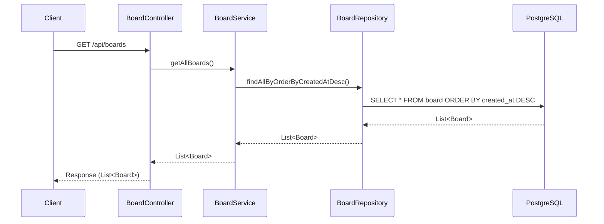
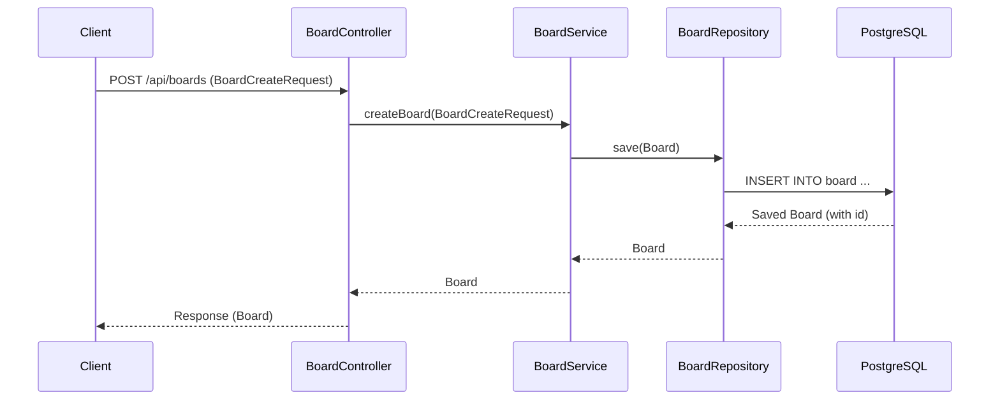
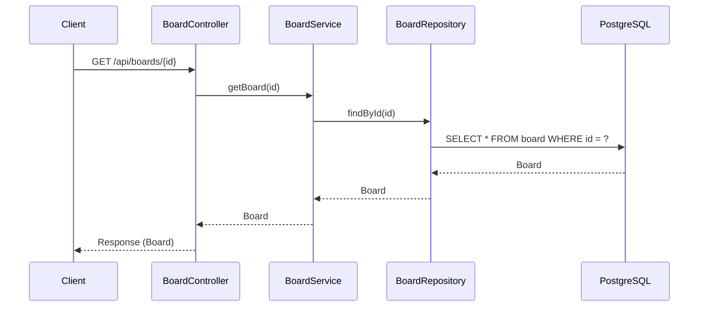
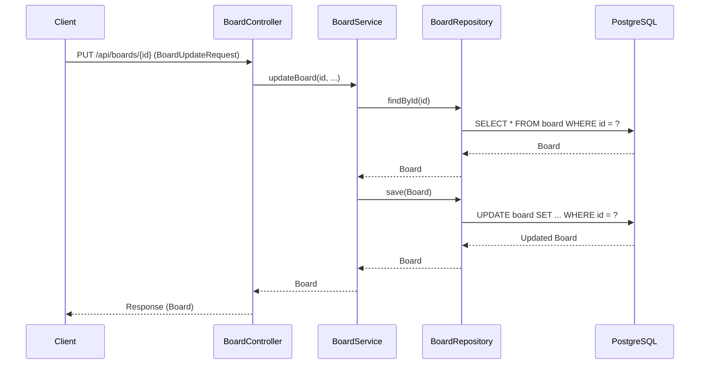
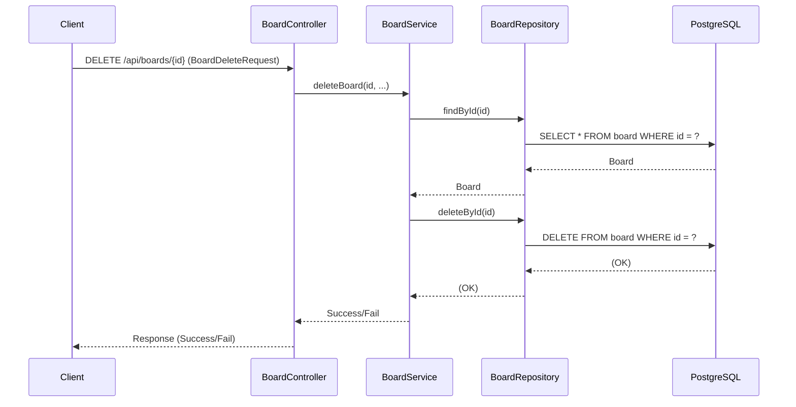

# 시퀀스 다이어그램

## 첫 번째: 전체 게시글 목록 조회 API의 시퀀스 다이어그램

```mermaid
sequenceDiagram
    participant Client
    participant BoardController
    participant BoardService
    participant BoardRepository
    participant PostgreSQL

    %% 전체 게시글 목록 조회
    Client->>BoardController: GET /api/boards
    BoardController->>BoardService: getAllBoards()
    BoardService->>BoardRepository: findAllByOrderByCreatedAtDesc()
    BoardRepository->>PostgreSQL: SELECT * FROM board ORDER BY created_at DESC
    PostgreSQL-->>BoardRepository: List<Board>
    BoardRepository-->>BoardService: List<Board>
    BoardService-->>BoardController: List<Board>
    BoardController-->>Client: Response (List<Board>)
```

## 두 번째: 게시글 작성

```mermaid
sequenceDiagram
    participant Client
    participant BoardController
    participant BoardService
    participant BoardRepository
    participant PostgreSQL

    %% 게시글 작성
    Client->>BoardController: POST /api/boards (BoardCreateRequest)
    BoardController->>BoardService: createBoard(BoardCreateRequest)
    BoardService->>BoardRepository: save(Board)
    BoardRepository->>PostgreSQL: INSERT INTO board ...
    PostgreSQL-->>BoardRepository: Saved Board (with id)
    BoardRepository-->>BoardService: Board
    BoardService-->>BoardController: Board
    BoardController-->>Client: Response (Board)
```

## 세 번째: 선택한 게시글 조회

```mermaid
sequenceDiagram
    participant Client
    participant BoardController
    participant BoardService
    participant BoardRepository
    participant PostgreSQL

    %% 선택한 게시글 조회
    Client->>BoardController: GET /api/boards/{id}
    BoardController->>BoardService: getBoard(id)
    BoardService->>BoardRepository: findById(id)
    BoardRepository->>PostgreSQL: SELECT * FROM board WHERE id = ?
    PostgreSQL-->>BoardRepository: Board
    BoardRepository-->>BoardService: Board
    BoardService-->>BoardController: Board
    BoardController-->>Client: Response (Board)
```

## 네 번째: 선택한 게시글 수정

```mermaid
sequenceDiagram
    participant Client
    participant BoardController
    participant BoardService
    participant BoardRepository
    participant PostgreSQL

    %% 선택한 게시글 수정
    Client->>BoardController: PUT /api/boards/{id} (BoardUpdateRequest)
    BoardController->>BoardService: updateBoard(id, ...)
    BoardService->>BoardRepository: findById(id)
    BoardRepository->>PostgreSQL: SELECT * FROM board WHERE id = ?
    PostgreSQL-->>BoardRepository: Board
    BoardRepository-->>BoardService: Board
    BoardService->>BoardRepository: save(Board)
    BoardRepository->>PostgreSQL: UPDATE board SET ... WHERE id = ?
    PostgreSQL-->>BoardRepository: Updated Board
    BoardRepository-->>BoardService: Board
    BoardService-->>BoardController: Board
    BoardController-->>Client: Response (Board)
```

## 다섯 번째: 선택한 게시글 삭제

```mermaid
sequenceDiagram
    participant Client
    participant BoardController
    participant BoardService
    participant BoardRepository
    participant PostgreSQL

    %% 선택한 게시글 삭제
    Client->>BoardController: DELETE /api/boards/{id} (BoardDeleteRequest)
    BoardController->>BoardService: deleteBoard(id, ...)
    BoardService->>BoardRepository: findById(id)
    BoardRepository->>PostgreSQL: SELECT * FROM board WHERE id = ?
    PostgreSQL-->>BoardRepository: Board
    BoardRepository-->>BoardService: Board
    BoardService->>BoardRepository: deleteById(id)
    BoardRepository->>PostgreSQL: DELETE FROM board WHERE id = ?
    PostgreSQL-->>BoardRepository: (OK)
    BoardRepository-->>BoardService: (OK)
    BoardService-->>BoardController: Success/Fail
    BoardController-->>Client: Response (Success/Fail)
```